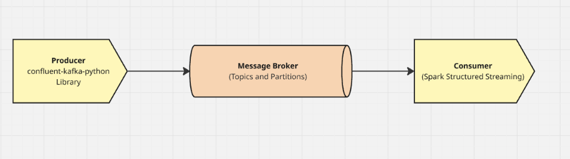

# Stream Gate - Apache Kafka Version (1.0)

# 1. Data Flow Diagram:

---

# 2. Aim:

The primary goal of this version is to establish a **reliable, real-time data bridge** between a raw JSON data source and a big data processing engine. It focuses on functional connectivity and low-latency throughput, deferring complex data governance (like Schema Registry and Avro) to later iterations.

---

# 3. The Tech Stack:

- **Data Source:** JSON objects (generated via your brother's code/Faker).
- **Producer:** `confluent-kafka-python` library.
- **Message Broker:** Apache Kafka (handling topics and partitions).
- **Consumer:** Apache Spark (using the **Spark Structured Streaming** module).
- **Format:** Plain JSON over the wire.

---

# 4. Detailed Step-by-Step Flow:

- **Data Generation & Serialization**
The Python script receives JSON data. Since we aren't using a Schema Registry, the producer simply serializes the dictionary into a string/bytes format and pushes it to Kafka.
- **The Kafka Topic (The Buffer)**
The data lands in a specific **Kafka Topic**.
    - **Partitions:** This is where your parallelism happens. Even in V1, you can set multiple partitions (e.g., 3). This allows Kafka to balance the load and allows Spark to read data in parallel.
    - **Persistence:** Kafka stores this data temporarily, ensuring that if the Spark job restarts, no data is lost.
- **Spark Connection (The "Glue")**
On the consumer side, Spark uses the `readStream` format with the `kafka` source. You point it to your bootstrap servers and the specific topic name.
- **Schema Definition (On-Read)**
Since the data in Kafka is "schema-less" JSON, you will define a **StructType** inside your Spark code. Spark applies this schema as it reads the data to turn the JSON strings into a structured DataFrame.
- **Streaming Execution**
Spark Structured Streaming processes the data in "micro-batches," allowing you to perform transformations or write the data to a final destination (like a database or data lake) in near real-time.

---

# 5. For more specifics:

[00_Overview: Stream Gate (v1.0)](00_Overview%20Stream%20Gate%20(v1%200)%202fbf0129bb7980fcafd0c0c9523d6dd9.md)

[01_Producer: Ingestion Layer](01_Producer%20Ingestion%20Layer%202fbf0129bb798058a7f7d725908bdcc3.md)

[02_Kafka Topics: The Gate](02_Kafka%20Topics%20The%20Gate%202fbf0129bb798021b9c3e339ad874c64.md)

[03_Consumer: Processing Layer](03_Consumer%20Processing%20Layer%202fbf0129bb79806b9bf0cd4fc79fbadc.md)