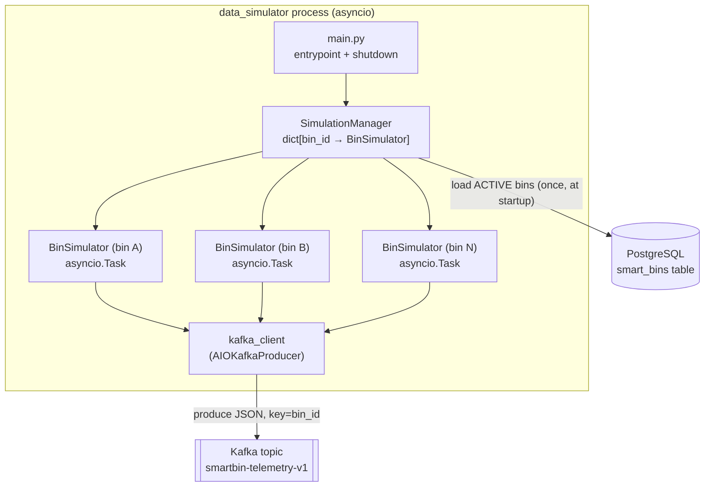

# Architecture

The Data Simulator is a single Python 3.12 asyncio process that simulates a
fleet of IoT smart trash bins and publishes their telemetry to Kafka. It reads
static bin metadata from PostgreSQL, then generates dynamic telemetry (fill
level, battery level, location, timestamp) entirely in memory.

This document covers the runtime structure and component interactions. For
env-var details see [configuration.md](configuration.md); for the simulation
math see [simulation-engine.md](simulation-engine.md).

---

## System diagram

Verified sources: `src/main.py`, `src/simulator/simulation_manager.py`,
`src/simulator/bin_simulator.py`, `src/kafka_producer.py`, `src/database.py`,
`docker-compose.yml`.

---

## Major components

| Component | File | Role |
| --- | --- | --- |
| Entrypoint | `src/main.py` | Boots the Kafka client and `SimulationManager`, wires signal handlers, and performs bounded graceful shutdown. |
| Simulation Manager | `src/simulator/simulation_manager.py` | In-memory registry mapping `bin_id → BinSimulator`. Loads ACTIVE bins from the DB and starts a simulator per bin. |
| Bin Simulator | `src/simulator/bin_simulator.py` | Owns one `Bin` and runs a long-lived asyncio task that updates state and publishes telemetry on an interval. |
| Bin (domain model) | `src/models/bin.py` | Pure in-memory object holding a bin's live state and producing the telemetry payload. Infrastructure-agnostic. |
| Kafka client | `src/kafka_producer.py` | Module-level singleton `kafka_client` wrapping `AIOKafkaProducer`, with start-up retries and per-message error handling. |
| Database layer | `src/database.py` | Async SQLAlchemy engine + `AsyncSessionLocal` factory + the `SmartBin` ORM model (static bin metadata). |
| Config | `src/config.py` | Pydantic `Settings`, cached via `get_settings()`. |
| Logging | `src/logging_config.py` | Root logging setup + runtime DEBUG toggle via SIGUSR1. |

---

## Runtime flow

Startup (from `src/main.py`):

1. `setup_logging()` runs once at import time (module top of `main.py`).
2. `await kafka_client.start()` — connects the producer, retrying up to 10 times
   (3s apart) before raising (`src/kafka_producer.py:16-44`).
3. `SimulationManager()` is constructed, then `await manager.initialize()`
   opens one DB session, selects `SmartBin` rows `where status == "ACTIVE"`, and
   for each row builds a `Bin`, wraps it in a `BinSimulator`, calls
   `simulator.start()`, and registers it
   (`src/simulator/simulation_manager.py:34-65`).
4. SIGINT/SIGTERM handlers are installed (via `loop.add_signal_handler`, or
   `signal.signal` on Windows) that set an `asyncio.Event`
   (`src/main.py:35-48`).
5. `await stop_event.wait()` — the process now idles while the per-bin tasks run.

Steady state: each `BinSimulator._run()` loops — mutate bin state
(`_simulate()`), build a payload (`Bin.to_payload()`), `await
kafka_client.send_telemetry(...)`, then `await asyncio.sleep(SIMULATION_INTERVAL)`
(`src/simulator/bin_simulator.py:118-147`).

Shutdown (on signal): `manager.stop()` cancels every simulator task and clears
the registry, then `kafka_client.stop()` flushes/closes the producer, then
`engine.dispose()` closes DB connections. Each teardown is wrapped in
`asyncio.wait_for(..., timeout=5.0)` and its own try/except so one slow
component cannot block the others (`src/main.py:52-68`).

---

## Concurrency: what is async vs. sync

- **Async (`asyncio`):** the Kafka producer (`aiokafka`), all DB access
  (SQLAlchemy async engine + `asyncpg`), the per-bin `_run()` loops, and
  `main()` itself. Concurrency is cooperative on a single event loop — there are
  no threads or subprocesses. See [decisions/001-asyncio.md](decisions/001-asyncio.md).
- **Sync (CPU-only, no I/O):** the telemetry math in
  `BinSimulator._simulate()` and `Bin.to_payload()`; these run to completion
  between `await` points and never block on I/O.

`SimulationManager`'s registry mutation helpers (`add_bin`, `update_bin`,
`get_simulator`, `exists`) are plain synchronous methods; `remove_bin` and
`stop` are async because they await simulator shutdown.

---

## State: what is stateful vs. stateless

- **PostgreSQL (durable, static):** only bin *metadata* — `bin_id`, `capacity`,
  `latitude`, `longitude`, `status`, `created_at`, `updated_at`
  (`src/database.py:13-34`). The simulator reads this once at startup and does
  **not** write telemetry back.
- **In-memory (ephemeral, dynamic):** the live `current_fill_level` and
  `battery_level` on each `Bin` (`src/models/bin.py:60-61`), plus the
  `SimulationManager._simulators` registry. All of this is lost on restart and
  rebuilt from the DB.
- **Kafka (durable stream):** the emitted telemetry payloads — the only durable
  record of the dynamic simulation output.

> The `Bin` docstring states the design intent explicitly: "Only static bin
> metadata is persisted. Dynamic simulation state (fill level, battery level,
> etc.) is maintained in memory by the simulator"
> (`src/database.py:14-20`, mirrored in `src/models/bin.py:6-18`).

---

## Deployment shape

All three components run as containers defined in `docker-compose.yml`:
`smartbin_postgres` (postgres:15-alpine), `smartbin_kafka`
(confluentinc/cp-kafka:7.4.1, KRaft mode — no ZooKeeper), and `data_simulator`
(built from the service `Dockerfile`). `data_simulator` `depends_on` postgres
with `condition: service_healthy`. See [deployment.md](deployment.md) and
[kafka.md](kafka.md).

---

## Known architectural gaps (verified in code)

- The `SimulationManager` load is **one-shot at startup**. There is no
  mechanism to pick up bins added to the DB after boot. The `add_bin` /
  `update_bin` / `remove_bin` methods exist but are not wired to any trigger —
  the code comment flags this: "Add, update, delete - need to be implemented
  with Fast API in future involving DB interaction"
  (`src/simulator/simulation_manager.py:67`).
- `NUMBER_OF_BINS` (config) does **not** cap or drive the number of simulators;
  the count is whatever the DB returns. See [configuration.md](configuration.md).
